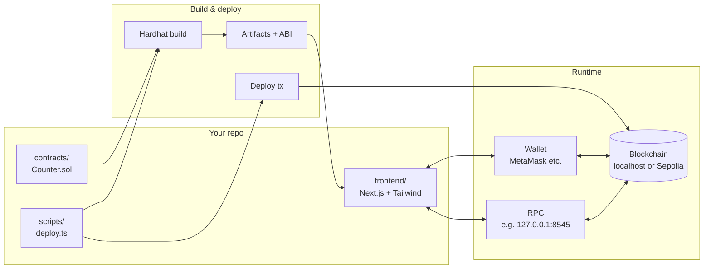
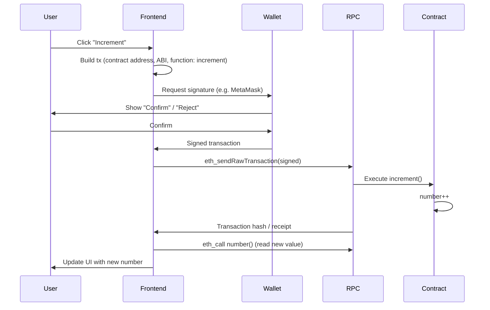
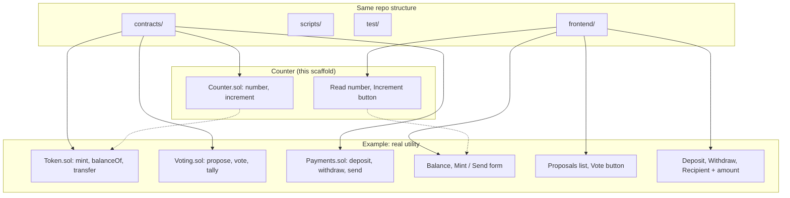

# Crypto Dapp

A minimal **decentralized app (dapp)** scaffold: smart contracts (Solidity + Hardhat 3) and a web frontend (Next.js + wallet connect). There is **no backend server**—the blockchain and your contracts are the backend.

## What’s the point?

- **Learn the stack:** Contract → build → test → deploy → frontend that reads/writes on-chain.
- **Reuse the structure:** Swap the Counter for a token, a vote, or a payment flow and follow the same pattern.
- **See the mental model:** Users sign transactions with their wallet; the frontend only talks to the chain via RPC and never holds keys.

---

## How it fits together



- **contracts/** — Solidity. Compiled by Hardhat → bytecode + ABI.
- **scripts/deploy.ts** — Sends a transaction that creates the contract on the chain; you get back an **address**.
- **frontend** — Uses that address + ABI to call the contract. The user’s **wallet** signs transactions; the app never sees private keys. **RPC** (e.g. localhost:8545) is how the app reads state and submits signed txs.

---

## What happens when you click “Increment”



The frontend never touches your keys. It only builds the transaction and asks the wallet to sign; the wallet talks to the chain (or the app sends the signed tx via RPC). The contract runs on the chain; the UI just reads and triggers.

---

## Beyond the counter: what “real utility” looks like

The **shape** of the repo stays the same: contracts, deploy script, tests, frontend. Only the contract logic and UI change.



| Idea | Contract (what’s on-chain) | Frontend (what the user does) |
|------|---------------------------|-------------------------------|
| **Token** | Mint, balances, transfers (e.g. ERC-20) | Show balance, “Mint” / “Send” forms |
| **Voting** | Proposals, cast vote, read tally | List proposals, “Vote” button, results |
| **Payments / tipping** | Deposit, withdraw, send to address | Connect wallet, enter amount + recipient, submit |
| **Registry / proof** | Store hash or attestation, timestamp | “Register” form, link to tx/block explorer |

You still: **write contract → build → test → deploy (same script pattern) → put address in frontend env → frontend calls contract**. The Counter is the smallest version of that loop; “real utility” is a different contract and UI, same pipeline.

---

## Repo structure

| Path | Purpose |
|------|---------|
| `contracts/` | Solidity (e.g. `Counter.sol`) |
| `scripts/` | Deploy script (run with `--network localhost` or `sepolia`) |
| `test/` | Contract tests (Hardhat + Mocha) |
| `frontend/` | Next.js app (Tailwind, RainbowKit + wagmi) |
| `hardhat.config.ts` | Networks, Solidity version, plugins |

---

## Prerequisites

- **Node.js 22+** (for Hardhat 3)
- npm (or yarn/pnpm)

## Setup

```bash
# From repo root: install Hardhat and contract deps
npm install

# Frontend has its own deps (avoids "Provider not found" from workspace hoisting)
cd frontend && npm install && cd ..

cp .env.example .env   # optional; for Sepolia deploy
```

## Commands

| Command | Description |
|--------|-------------|
| `npm run compile` or `npm run build` | Build Solidity contracts |
| `npm run test` | Run contract tests |
| `npm run node` | Start local Hardhat node (leave running) |
| `npm run deploy:local` | Deploy to local node |
| `npm run deploy:sepolia` | Deploy to Sepolia (set `SEPOLIA_RPC_URL`, `PRIVATE_KEY` in `.env`) |
| `npm run frontend` | Start Next.js dev server |

## Run locally (full flow)

1. **Terminal 1:** `npm run node`
2. **Terminal 2:** `npm run deploy:local` → copy the printed contract address
3. **`frontend/.env.local`:**  
   `NEXT_PUBLIC_CONTRACT_ADDRESS=0xYourDeployedAddress`
4. **Terminal 3:** `npm run frontend` → open http://localhost:3000  
   Connect MetaMask to **Localhost 8545**, then use the Counter UI.

## Optional: WalletConnect

Create a project at [WalletConnect Cloud](https://cloud.walletconnect.com/) and in `frontend/.env.local` set:

```env
NEXT_PUBLIC_WALLETCONNECT_PROJECT_ID=your_project_id
```

## Networks

- **localhost (8545)** — Local Hardhat node; default for development.
- **Sepolia** — Testnet; use a [faucet](https://sepoliafaucet.com/) for test ETH. Set `SEPOLIA_RPC_URL` and `PRIVATE_KEY` in root `.env`. Add the chain in `frontend/app/providers.tsx` to use it in the app.

---

## Troubleshooting: “Connect wallet” / MetaMask does nothing

1. **MetaMask installed?**  
   You need the [MetaMask browser extension](https://metamask.io/download/) (Chrome, Firefox, Brave, etc.). The app talks to the extension; without it, the button can do nothing.

2. **Unlock MetaMask**  
   Open the extension (click the fox icon) and log in with your password. If it’s on the lock screen, connection requests may not show.

3. **Allow popups for localhost**  
   MetaMask opens a **popup** to ask “Connect?” / “Switch network?”. Browsers often block popups by default.  
   - Check the address bar for a blocked-popup icon (e.g. 🚫 or “Pop-up blocked”).  
   - Click it and choose “Always allow pop-ups from localhost:3000” (or your frontend URL).  
   - Refresh the page and try “Connect” → MetaMask again.

4. **Add the Hardhat network in MetaMask**  
   So the app and MetaMask agree on the chain:  
   - Open MetaMask → click the network dropdown (e.g. “Ethereum Mainnet”) → “Add network” / “Add a network manually”.  
   - Use:  
     - **Network name:** `Localhost 8545`  
     - **RPC URL:** `http://127.0.0.1:8545`  
     - **Chain ID:** `31337`  
     - **Currency symbol:** `ETH`  
   - Save. Switch to “Localhost 8545”, then try connecting again from the frontend.

5. **Check the browser console**  
   Open DevTools (F12 or right‑click → Inspect) → **Console** tab. Click “Connect” → MetaMask and see if any red errors appear. That often explains silent failures (e.g. missing provider, wrong chain).
